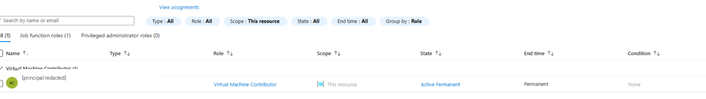
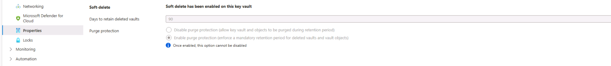
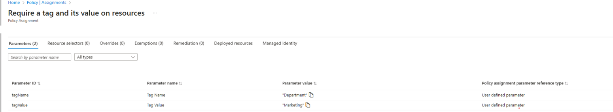
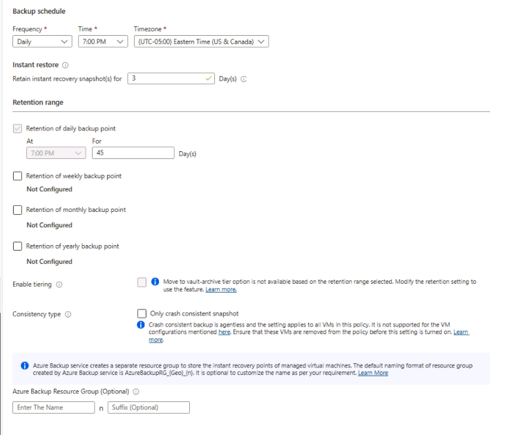

# Evidence Summary

## Purpose

This document defines the public-safe evidence model for the Azure Cloud Security Governance project.

The goal is to explain what evidence supports each control area without exposing tenant identifiers, subscription identifiers, personal accounts, raw source context, or unrelated screenshots.

This file should be used as the review checklist before adding or updating images in the repository.

## Evidence Handling Rules

Before any screenshot is uploaded publicly, confirm:

- The image is cropped to the relevant Azure configuration pane.
- Tenant IDs are removed or not visible.
- Subscription IDs are removed or not visible.
- User emails and personal identifiers are removed or not visible.
- Resource IDs and sensitive names are removed or not visible.
- Raw source context, instructional text, or unrelated browser content is not visible.
- Browser bookmarks, chat windows, desktop taskbar, and unrelated tabs are not visible.
- The screenshot supports a specific claim in this repository.
- The screenshot has a professional filename.
- The screenshot has a caption explaining what it proves.

## Evidence Index

| Evidence File | Control Area | What It Proves | Caption |
|---|---|---|---|
| `images/rbac-resource-group-scope.png` | RBAC / Least Privilege | Role assignment is scoped to the selected resource group. | Azure RBAC role assignment showing Virtual Machine Contributor access scoped to the selected resource group. |
| `images/key-vault-soft-delete-purge-protection.png` | Key Management | Key Vault recovery protections are configured. | Azure Key Vault recovery settings showing soft delete enabled and purge protection configured. |
| `images/azure-policy-department-tag.png` | Policy Governance | Azure Policy is used to require a Department tag and value. | Azure Policy assignment requiring the Department tag and a department-specific value. |
| `images/recovery-services-backup-policy.png` | Backup and Recovery | Backup policy schedule and retention settings are documented. | Recovery Services backup policy showing daily backup schedule, instant restore retention, and daily retention configuration. |

## Evidence 1: RBAC Resource Group Scope

### File

```text
images/rbac-resource-group-scope.png
```



Caption: Azure RBAC role assignment showing Virtual Machine Contributor access scoped to the selected resource group.

### Control Area

Access control and least privilege.

### What It Proves

This evidence shows that Azure access can be scoped to a resource group rather than described as broad tenant-wide access.

### Security Interpretation

Resource group scoped RBAC supports least-privilege access design and reduces unnecessary cross-department visibility.

### Limitation

This screenshot supports scoped RBAC evidence in a simulated lab environment. It does not claim production identity governance ownership.

## Evidence 2: Key Vault Soft Delete and Purge Protection

### File

```text
images/key-vault-soft-delete-purge-protection.png
```



Caption: Azure Key Vault recovery settings showing soft delete enabled and purge protection configured.

### Control Area

Key management and recovery protection.

### What It Proves

This evidence shows Key Vault recovery protections such as soft delete and purge protection.

### Security Interpretation

Key Vault recovery protections reduce the risk of immediate permanent loss of key-management assets after accidental or malicious deletion.

### Limitation

This screenshot supports recovery-protection configuration evidence. It does not claim production key-management administration.

## Evidence 3: Azure Policy Department Tag

### File

```text
images/azure-policy-department-tag.png
```



Caption: Azure Policy assignment requiring the Department tag and a department-specific value.

### Control Area

Governance and resource ownership.

### What It Proves

This evidence shows Azure Policy being used to support Department tag governance.

### Security Interpretation

Tag governance helps security and operations teams identify ownership, cost responsibility, and triage accountability for cloud resources.

### Limitation

This screenshot supports policy-governance evidence in a simulated environment. It does not claim production compliance enforcement.

## Evidence 4: Recovery Services Backup Policy

### File

```text
images/recovery-services-backup-policy.png
```



Caption: Recovery Services backup policy showing daily backup schedule, instant restore retention, and daily retention configuration.

### Control Area

Backup and recovery readiness.

### What It Proves

This evidence shows backup policy configuration, including schedule and retention settings.

### Security Interpretation

Backup policy evidence supports continuity planning, ransomware recovery planning, and audit review.

### Limitation

This screenshot proves backup policy configuration. It does not prove restore testing or production recovery validation.

## Screenshot Review Checklist

Use this checklist before adding or replacing images:

```text
[ ] No tenant IDs.
[ ] No subscription IDs.
[ ] No personal email addresses.
[ ] No customer data.
[ ] No raw source context.
[ ] No unrelated instructional text.
[ ] No full desktop or taskbar.
[ ] No unrelated browser tabs.
[ ] No sensitive resource IDs.
[ ] Screenshot is cropped to the relevant Azure pane.
[ ] Filename is professional and descriptive.
[ ] Screenshot supports a specific claim in README.md or docs/.
[ ] Caption explains what the screenshot proves.
```

## Public-Safe Evidence Standard

Evidence should support claims without creating unnecessary exposure.

If a screenshot is unclear, overly broad, or difficult to explain, do not upload it.

If a claim cannot be supported by sanitized evidence or public documentation, rewrite the claim as simulated design rationale or remove it.

## Limitations

- Evidence is from a simulated environment.
- No production tenant evidence is included.
- No customer evidence is included.
- No formal compliance certification is claimed.
- No restore-test completion is claimed.
- No production Microsoft Sentinel, Defender XDR, or Defender for Cloud operation is claimed.

## Future Evidence Improvements

Future versions may add:

- Additional sanitized Azure screenshots if they support specific claims.
- Defender for Cloud compliance posture screenshots, if available and sanitized.
- Azure Activity Log review examples.
- Example KQL queries for governance-related activity.
- Backup job health or restore-test evidence.
- Additional mapping to Microsoft Cloud Security Benchmark.
